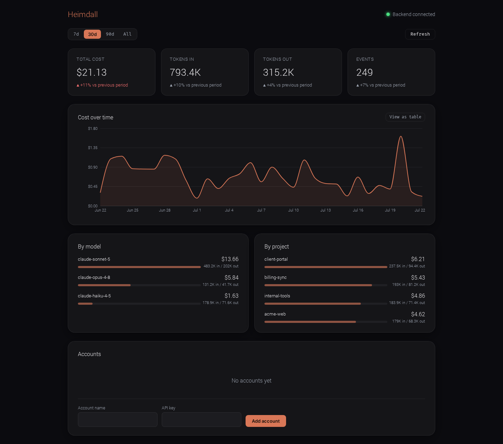
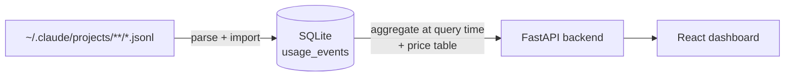

# Heimdall

[](https://github.com/kostja38/heimdall/actions/workflows/ci.yml)
[](LICENSE)

> Local usage & cost tracking for Claude accounts — no cloud, no telemetry.



## Why

Claude Code doesn't ship a built-in view of what you're spending. If you're
a freelancer juggling several client accounts — or just curious where your
tokens go — there's no good native answer short of reading raw JSONL logs
by hand.

Heimdall reads your local usage, computes cost from a price table, and
shows it on a dashboard. Nothing leaves your machine.

- **Local-first.** No server, no cloud, no telemetry.
- **Data-sparse.** Your usage data never leaves your machine.
- **Honest about cost.** Prices are computed at query time from a small
  table, never billed or guessed — see [How it works](#how-it-works).

## How it works

Heimdall is designed around two usage sources; today one is built:

- **Local Claude Code logs** (default, zero setup) — parses the JSONL
  session logs Claude Code already writes to
  `~/.claude/projects/**/*.jsonl` and computes cost from a model price
  table. This is what ships today.
- **Anthropic Admin API** (optional, planned) — for org admins who want
  real billed numbers instead of computed estimates, via an org-admin key.
  Not implemented yet — see [Roadmap](#roadmap).



Every API call Claude Code makes becomes one row in `usage_events` — raw
token counts only, deduplicated by event UUID. Cost is never stored; it's
computed from the current price table whenever you view the dashboard, so a
price change never leaves stale numbers behind.

## Quickstart

Heimdall isn't packaged for `pip`/`pipx` yet (planned — see
[Roadmap](#roadmap)). Until then, run it from a clone:

```bash
git clone https://github.com/kostja38/heimdall.git
cd heimdall
python -m venv .venv && source .venv/bin/activate
pip install -e ".[dev]"
uvicorn backend.main:app --reload
```

The backend runs on `http://127.0.0.1:8000` (interactive API docs at
`/docs`). In a second terminal, start the frontend:

```bash
cd frontend
npm install
npm run dev
```

Open `http://localhost:5173` — the dev server proxies `/api` and `/health`
to the backend. Hit **Refresh** on the dashboard to import your local Claude
Code logs for the first time.

## Security

Trust is the actual product here, so:

- **API keys never touch SQLite or disk in plaintext.** Account keys are
  written to your OS keychain via
  [`keyring`](https://pypi.org/project/keyring/) (macOS Keychain, Windows
  Credential Locker, Secret Service on Linux). The `accounts` table only
  ever stores `id` / `name` / `created_at`.
- **What Heimdall reads:** local Claude Code session logs under
  `~/.claude/projects/**/*.jsonl` (or `HEIMDALL_CLAUDE_LOGS`, see below).
  Nothing is sent anywhere — the FastAPI backend only listens on
  `127.0.0.1`.
- **What Heimdall stores:** raw token counts and metadata (model, project,
  timestamp) in a local SQLite file. No prompt or response content is ever
  read or stored.

## Configuration

| Variable | Default | Purpose |
|---|---|---|
| `HEIMDALL_DB` | `~/.heimdall/heimdall.db` | SQLite database path |
| `HEIMDALL_CLAUDE_LOGS` | `~/.claude/projects` | Root directory scanned for Claude Code JSONL logs |

## Development

```bash
# Backend
python -m pytest -q          # full test suite
ruff check .                 # lint
ruff format --check .        # format check

# Frontend (from frontend/)
npm run test                  # vitest
npm run check                 # biome lint + format check
npm run build                 # production build
```

Project layout:

```
backend/    FastAPI app, SQLite storage, log parsing, pricing (Python)
frontend/   React + Vite dashboard (TypeScript)
tests/      pytest suite for backend/
```

TDD is the norm: tests first, then the minimal implementation. Commits
follow [Conventional Commits](https://www.conventionalcommits.org/)
(`feat:`, `fix:`, `chore:`, …). Contributions welcome — open an issue or PR.

## Roadmap

- [x] SQLite schema + migrations
- [x] Encrypted key storage (OS keychain)
- [x] Local Claude Code log parser
- [x] Usage/cost API + price table
- [x] React dashboard (KPIs, cost-over-time, model/project breakdown)
- [x] Account management UI
- [x] Full README with screenshots *(this document)*
- [ ] `pip`/`pipx` CLI entrypoint + PyPI release
- [ ] Optional: Anthropic Admin API client for billed org-wide numbers

## License

[MIT](LICENSE)
